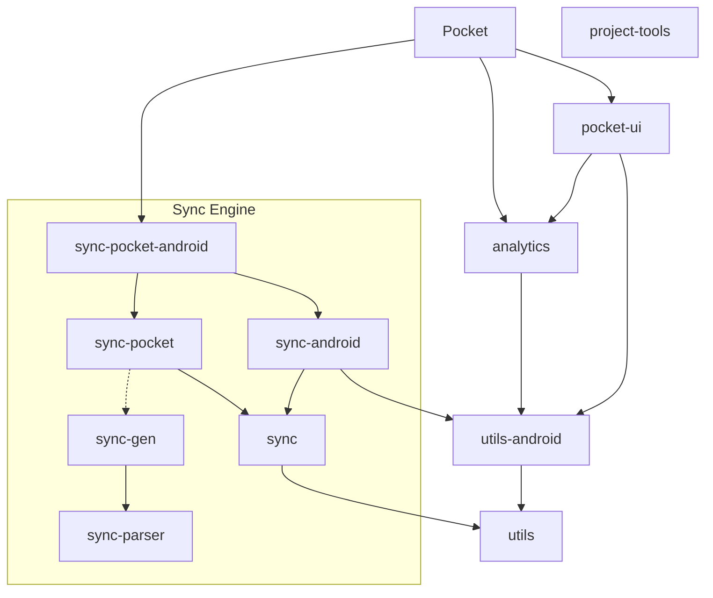

# Pocket Android

### Modules

There are a few modules in this project:

[Pocket](/Pocket) The Pocket app

[pocket-ui](/pocket-ui) Reusable Pocket UI/UX components and views.

[utils](/utils) and [utils-android](/utils-android) Utilities and classes that several modules share.

[sync-parser](/sync-parser) Parses GraphQL schema and creates an in-memory model (called "figments") for `sync-gen`.

[sync-gen](/sync-gen) Generates sync engine code from schema.

[sync](/sync) and [sync-android](/sync-android) General sync engine.

[sync-pocket](/sync-pocket) and [sync-pocket-android](/sync-pocket-android) Parts of the sync engine specific to the Pocket app.

[analytics](/analytics) Wraps Snowplow Android tracker and exposes internal API
that allows to declaratively annotate the UI and code to enable automatically picking up and sending
analytic events most of the time (and manually send whatever you need in edge cases).

[project-tools](/project-tools) Some utilities for doing tasks in this project like bulk importing vectors

See each module's README file for more details.



### Coding Conventions:
Use the checked in [code style](/.idea/codeStyles/Project.xml) as the default, but in general, be reasonable and use the code base as a guide.
For Kotlin we use the official Kotlin style.

### Dependencies
We're using [Renovate](https://docs.renovatebot.com/) to automatically update dependencies declared
in a [version catalog](/gradle/libs.versions.toml).

Because JSON doesn't support comments, here's some documentation on our [renovate.json](renovate.json):
```json
{
  "extends": [
    "local>Pocket/renovate-config"
  ]
}
```
Use a set of Pocket-wide defaults. See [Pocket/renovate-config](https://github.com/Pocket/renovate-config)
for more details and documentation.
```json
{
  "ignorePaths": ["buildSrc/**"]
}
```
Ignore our legacy dependency definitions in `buildSrc`, while we gradually migrate to version catalog.
```json
{
  "ignorePresets": [":dependencyDashboardApproval"]
}
```
Ignore the default setting from [Pocket/renovate-config](https://github.com/Pocket/renovate-config)
and allow opening PRs without approval.
```json
{
  "packageRules": [
    {
      "matchUpdateTypes": ["minor", "patch", "pin", "digest"],
      "automerge": true
    }
  ]
}
```
Amend the default config from [Pocket/renovate-config](https://github.com/Pocket/renovate-config)
and allow auto-merging minor version updates as well. This means only major updates will stay open
to let a human decide before merging.

```json
{
  "packageRules": [
    {
      "matchManagers": ["gradle", "gradle-wrapper"],
      "commitMessageTopic": "{{depName}}"
    }
  ]
}
```
Tweak the default commit message a bit to cut a redundant word from already pretty long messages.

### Sync Engine

We have a lot of documentation about the Sync Engine, but you kind of have to know where to look for it.
Here's some examples to get you started:
* sync modules' READMEs: [/sync-gen/README](/sync-gen/README.md), [/sync-parser/README](/sync-parser/README.md),
* sync packages' `package-info.java` files: [com.pocket.sync](/sync/src/main/java/com/pocket/sync/package-info.java),
  [com.pocket.sync.print.java](/sync-gen/src/main/java/com/pocket/sync/print/java/package-info.java) (code generation),
* sync class docs: [Pocket](sync-pocket/src/main/java/com/pocket/sdk/Pocket.java),
  [AppSource](sync/src/main/java/com/pocket/sync/source/AppSource.java),
  [V3Source](sync-pocket/src/main/java/com/pocket/sdk/api/source/V3Source.java),
  [ClientApiSource](sync-pocket/src/main/java/com/pocket/sdk/api/source/ClientApiSource.kt) (Pocket Graph source/client),
  [MutableSpace](sync/src/main/java/com/pocket/sync/space/mutable/MutableSpace.java) (persistence/"database"),
  etc.
* API documentation on the generated classes or in the schema files (`v3.graphqls`, `local.graphqls`, etc.)
* [Figment repo](https://github.com/Pocket/figment) which is deprecated,
  but I left a note in the main README about pieces that might still be relevant to the Android Sync Engine

### Other topics

[Gradle Configuration](buildSrc)

[Fonts](pocket-ui/src/main/assets)